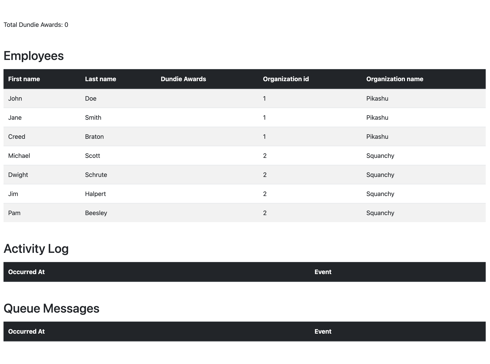

## Employee directory organization

This is an application for managing employees of a company. Employees belong to organizations within the company.

As recognition, employees can receive Dundie Awards.

* A `Dundie Award` is in reference to the TV show [The Office](https://en.wikipedia.org/wiki/The_Dundies) in which the main character hands out awards to his colleagues. For our purposes, it's a generic award.

## Instructions

In preparation for the upcoming call with NinjaOne, `clone` this repo and run it locally. If everything runs successfully, you will see the following page in your browser.

Become familiar with the application and it's characteristics. Use your favorite HTTP Client (like [Postman](https://www.postman.com/)) to exercise the endpoints and step through the code to help you get to know the application. 

In the call, we will introduce new code to the application, and you will comment on issues with the endpoint. Please be ready to share your screen in the call with us with the application ready to run. 

**Bonus:** Spot any issues or potential improvements you notice in the application while you're familiarizing yourself and make note of them for our call. We would love to see your input in how to make this application better.

## Improvements

* Swagger: http://localhost:3000/swagger-ui/index.html
* OpenAPI: http://localhost:3000/openapi
* Actuator: http://localhost:3000/actuator

## Run local
1) before start the application, run docker-compose up to get rabbitmq up and running.
2) Log into http://localhost:15672/
    Username: user
    Password: pass
Create a queue called: queueAward